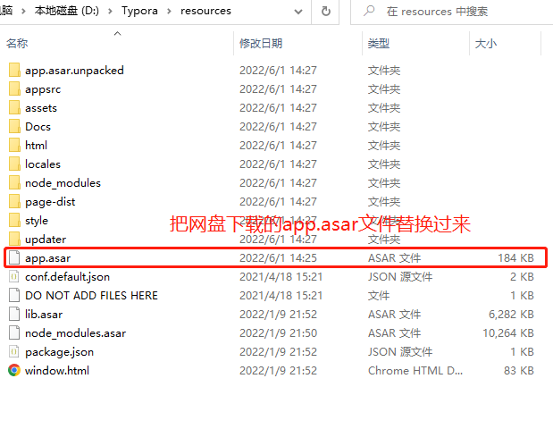
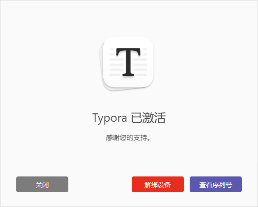

# 如何使用

## 下载
typora官方中文站：https://typoraio.cn/

百度云网盘：

链接：https://pan.baidu.com/s/1QDXiR3kAn4ZgnT9nhM2qiA
提取码：w7ww

## 破解

typora安装后

将百度云盘下载的app.asar.txt 文件中的后缀.txt去掉，并拷贝到typora安装路径下替换

我的路径是：D:\Typora\resources 根据自己的安装路径进行替换

## 输入序列号激活
1、打开 typora ，点击“输入序列号”：

2、邮箱一栏中任意填写（但须保证邮箱地址格式正确），输入序列号(在key.txt文件中，任选一条)，点击“激活”。

3、出现已激活即可

